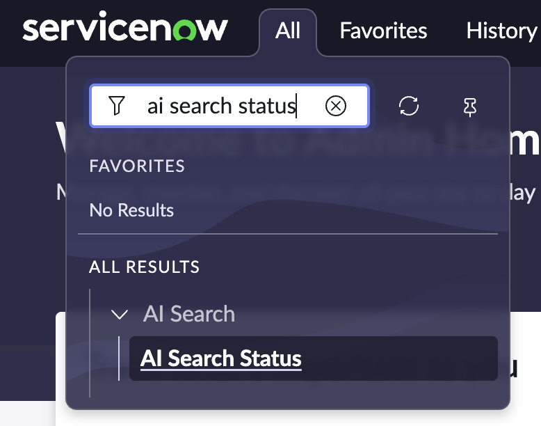

# Lab Configuration

Before starting the lab, let's make sure your lab instance is ready.

## Prerequisites Verification

1. **Log into the instance** with the "Magic link" as Admin
2. **Navigate to AI Search > AI Search Status**

3. **Verify AI Search is Active** - You should see a green check mark like this:

## Troubleshooting

If AI Search is **NOT** active, follow these steps:

### Option 1: Quick Repair
- Click [here to go to Appendix A3](appendix-a3-ai-search-setup.md) and follow the repair steps

### Option 2: Manual Reset
1. Navigate to **All > Repair Machine Learning Settings Tool**
2. In the right pane, find "Repair/Reset Machine Learning Settings"
3. Click **"Reset"**
4. Wait a few minutes for the instance to be ready
5. Return to verify AI Search status

## Instance Ready ✅

Once you see the green check mark for AI Search, you're ready to proceed to [Section 1: Start using Gen AI on Day 1](section1-start-using-genai.md).

---

**Next Step:** [Section 1 - Start using Gen AI on Day 1](section1-start-using-genai.md)