# Section 1. Start using Gen AI on Day 1

**Estimated time: 5 minutes**

Now Assist was designed so customers could launch quickly and with minimal lift. Our talented product teams built Now Assist to be turnkey. With the click of a button, you're off to the GenAI races.

## Section 1.1 Tour the Now Assist Admin Console

### Step 1: Access the Admin Console

1. Go to **All > Now Assist Admin > Overview**
2. Close the intro splash screen

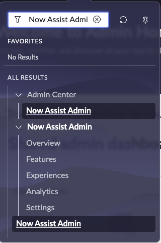
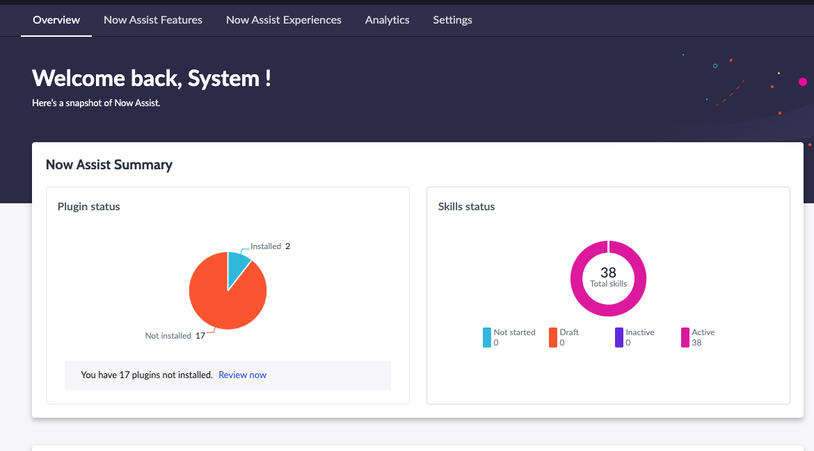

> **Important:** This lab uses Now Assist for IT Service Management and ITOM, but everything we will do mirrors what you would do for customer service cases, HR cases, work orders, etc.

### Step 2: Enable Now Assist for Virtual Agent

1. Click on **Now Assist Features > Platform > View details** on the Conversational Experience card

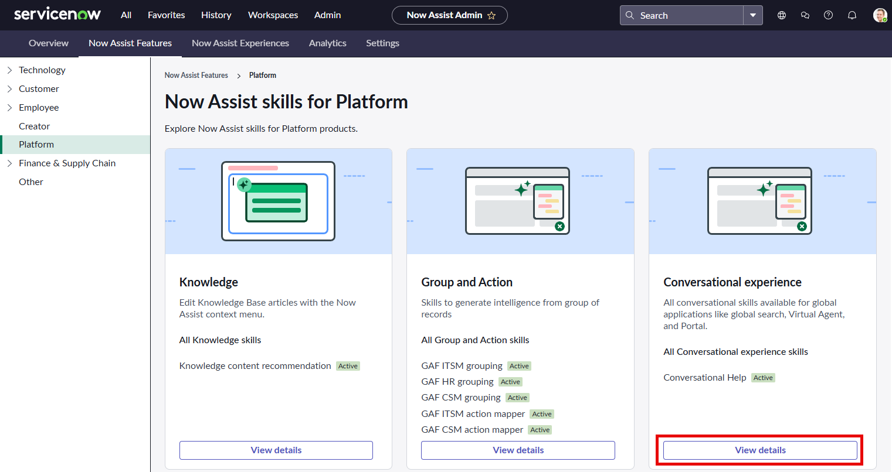

> **Note:** The card pictured might be in a different position on your screen.

2. Click on **Set up Now Assist in Virtual Agent**

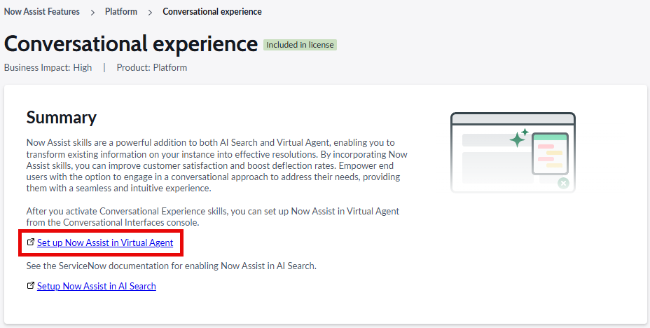

3. This will open a new tab; close the intro splash screen
4. Click on **Now Assist in Virtual Agent (default)**

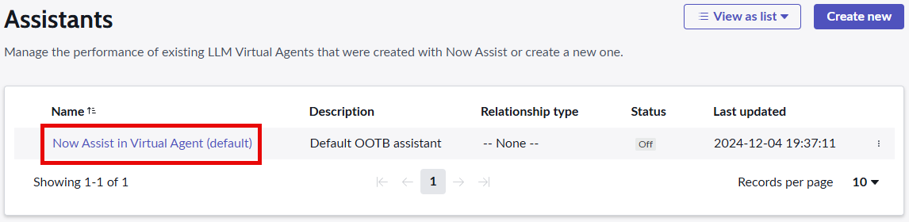

### Step 3: Configure Virtual Agent Settings

1. On the **Overview screen**, leave the fields as they are and click **Save and continue**
2. On the **Now Assist skills screen**, select **all available Skills** and click **Save and Continue**

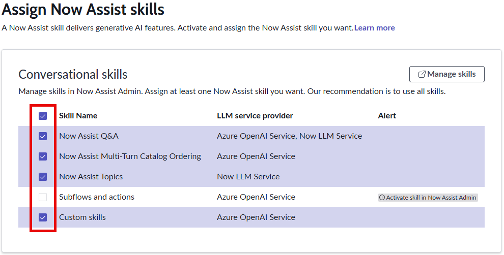

### Step 4: Add Virtual Agent to Portal

1. On the **Portals tab**, click the **Add portal** dropdown list
2. Select **Employee Center**
3. Click **Save and continue**

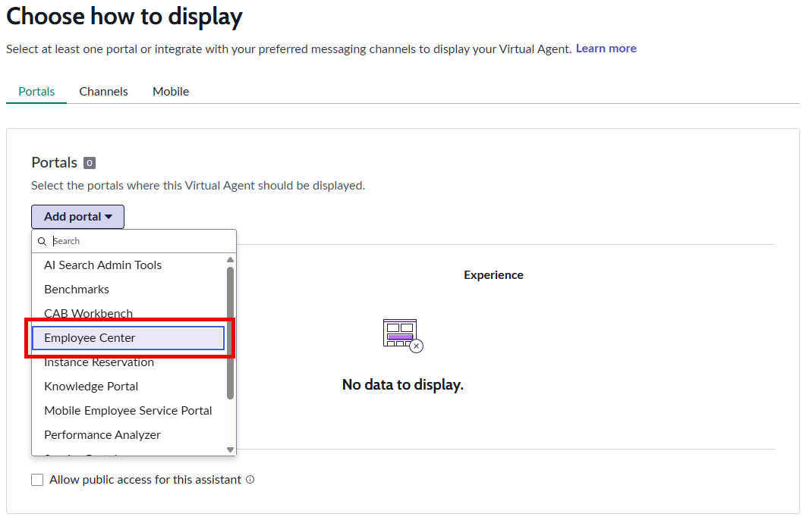

### Step 5: Configure Information Sources

1. On the **Choose information sources** screen, click **Save and continue**

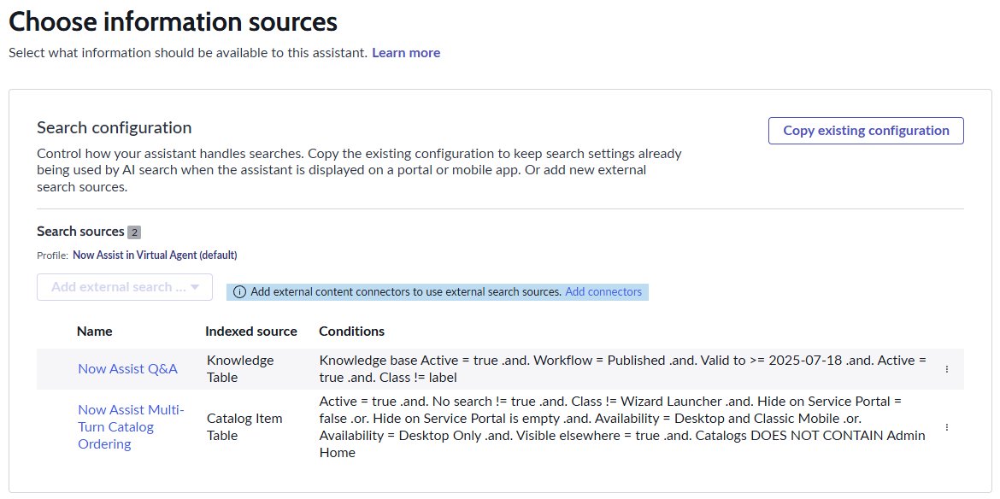

### Step 6: Customize Look and Feel

1. On the **look and feel** screen, click **Save and continue**

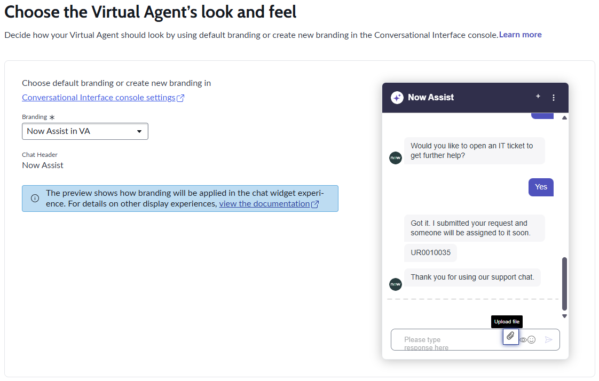

### Step 7: Customize Chat Experience

1. On the **Chat Experience** screen, update the greeting and closing messages with your own text
2. Click **Save and continue**

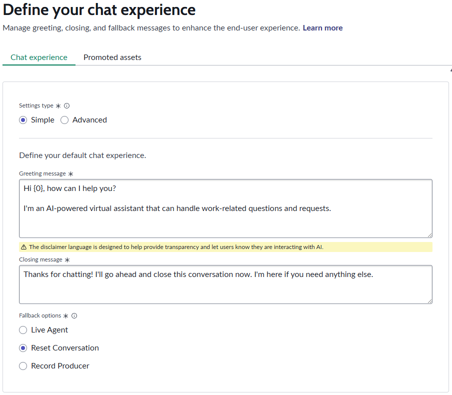

### Step 8: Review and Activate

1. On the **Review** screen, click **Turn on**
2. Click **Got it**

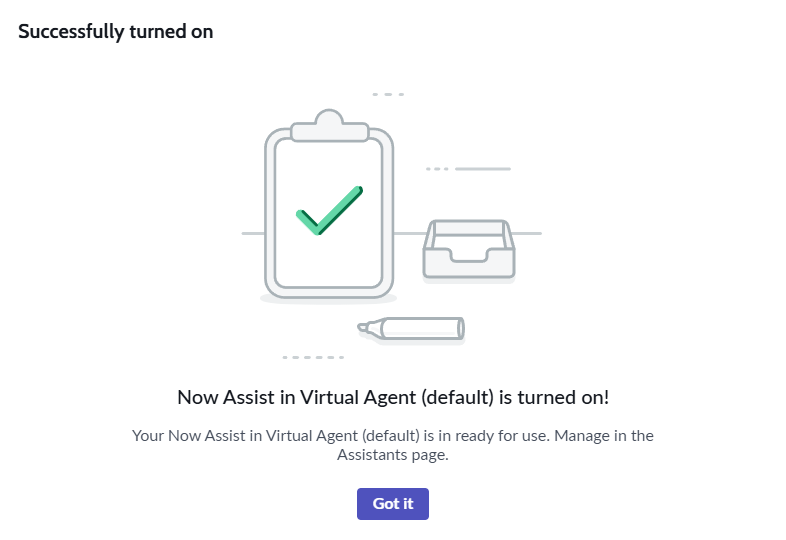

### Step 9: Explore Analytics

1. Navigate back to the **Now Assist Admin** console (All > Now Assist Admin > Overview)
2. Click the **Analytics** tab to view the Usage and Adoption dashboards

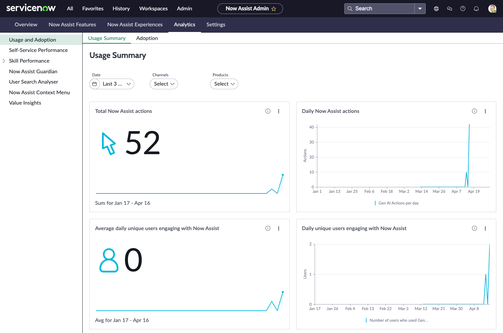

The dashboards provide a picture of the overall health and engagement for Now Assist.

### Step 10: Review Skill Performance

1. In the left-hand navigation menu, click **"Skill Performance"**
2. Use the date, products, and skills filters to change the data on view

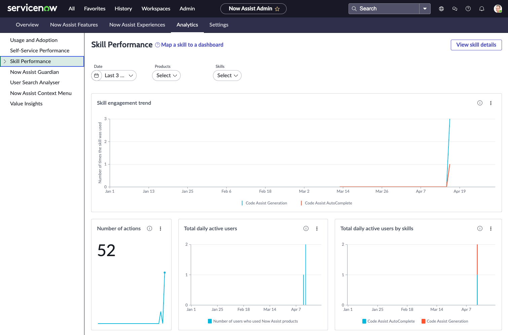

## 🎉 Congratulations!

You have successfully activated Now Assist and reviewed the Admin Console!

---

**Next Step:** [Section 2 - Building Agents and Use Cases](section2-building-agents-simple.md)