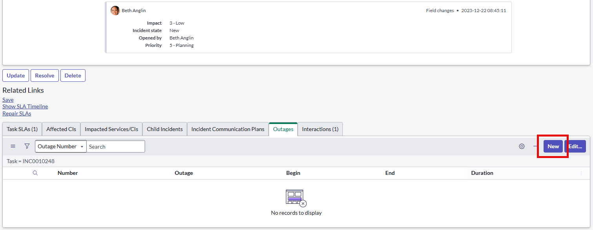
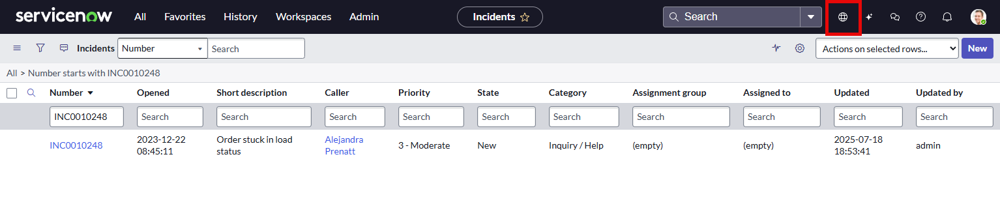
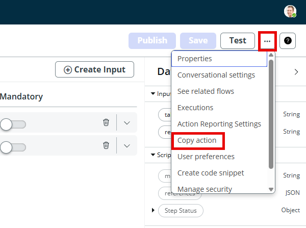
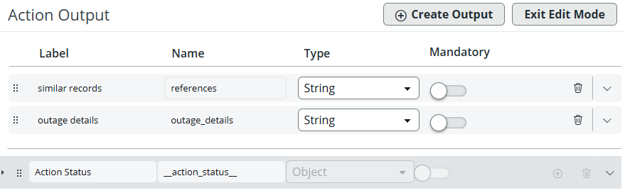
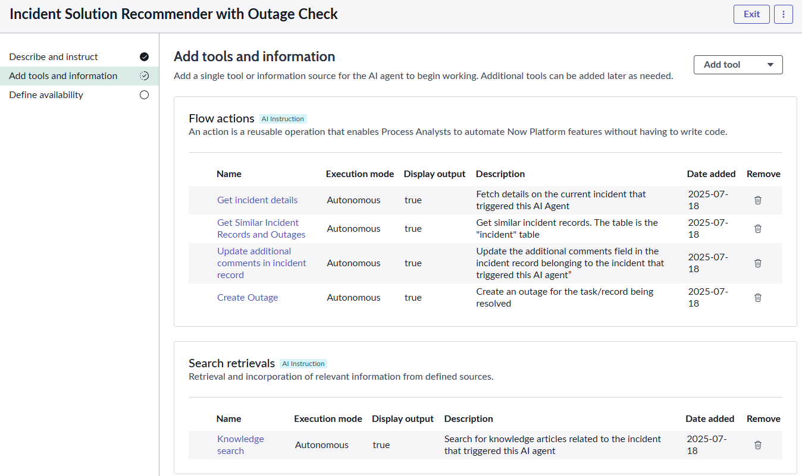
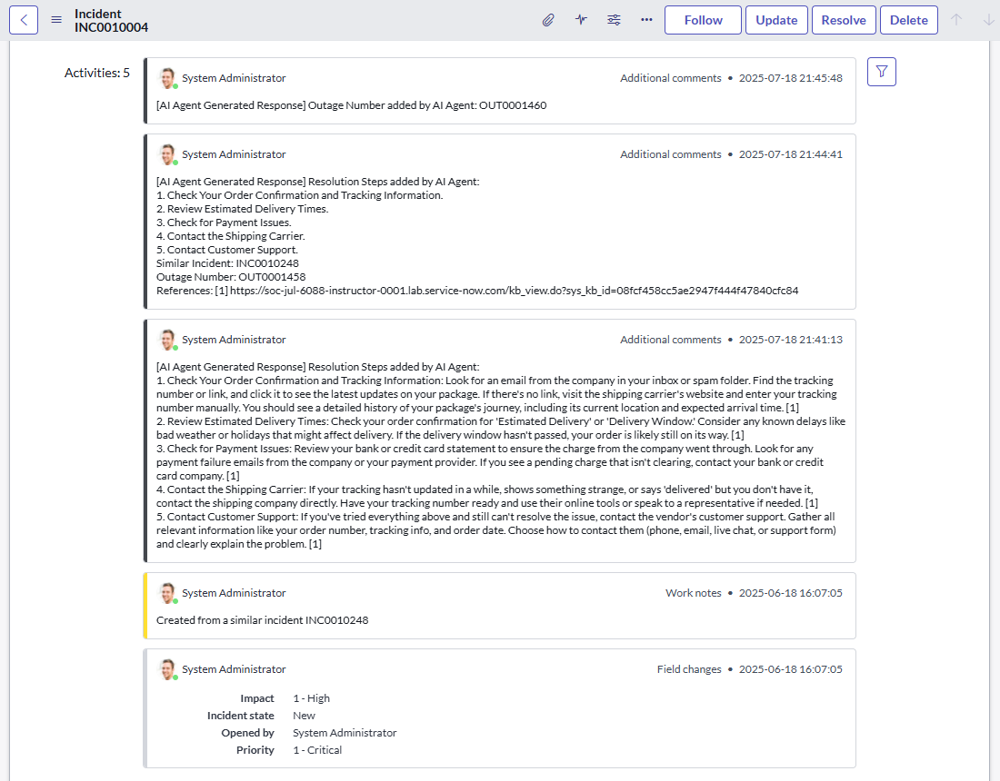

# Section 2. Building Agents and Use Cases

**Estimated time: 40 minutes**

In this section, you'll learn how to build AI agents and wrap them in use cases for automated deployment.

## Section 2.1 Build a Simple Agent

### Step 1: Access AI Agent Studio

1. Open **AI Agent Studio** (All > AI Agent Studio > Overview)
2. Locate the section titled **"Recent use cases and AI agents activity"**
3. Select the **AI Agents** tab
4. Click **"New"**


### Step 2: Configure the New AI Agent

A configuration page for "New AI agent" will open. Complete the fields with the information below:

**Basic Information:**
- **Name:** `Campus Guide`
- **Description:** `This agent's purpose is to provide directions to open areas of the hospital campus`

**AI Agent Role:**
```
You are a hospital concierge whose job is to provide directions to specific departments within the hospital. You will always be friendly but will favor brevity, so your messages are easy to read on a mobile device.
```

**Instructions (include the numbering):**
```
1. If it was not already provided, ask the visitor for their destination.
2. Look up the supplied destination in the location table. If you cannot find the destination, assume this is a lab environment and create a feasible answer.
3. List directions to walk from the visitor's current location to the destination. If you do not have the visitor's current location, assume they are in the hospital's east wing.
4. Give the outputted directions to the visitor as a numbered list.
```


> **Tip:** If you do not see the entry field for "AI Agent Role", you may be in the wrong section! Check the upper left corner of the screen and confirm that you are in the "New AI Agent" setup.

### Step 3: Save and Continue

4. Click **"Save and continue"**

### Step 4: Add Tools and Information

5. Next is the **"Add tools and information"** section
6. We are not adding tools for this agent, so simply click **"Save and continue"**

### Step 5: Define Availability

7. In **Define availability**, make sure the status is toggled to **On**
8. Click **Save and Test**


### Step 6: Test the Agent

Now let's test the agent!

1. In the **Task box** enter: `I need help finding my appointment`
2. Click **Start test**
3. When asked, type in any department name, e.g., `radiology`, and press enter
4. Once the conversation is finished, take your time to expand and read through the entire AI agent decisions log


**Understanding the Decision Log:**
- **Thought:** A recap on the overall mission of the agent followed by what the Agent thinks needs to be done next
- **Action:** The next step that the agent feels it needs to take. Note that in the absence of any tools the agent falls back to built-in capabilities for sending messages back to the user
- **Action Inputs:** The inputs the AI Agent decided to pass on to the tool or, in this case, the built-in fall-back capability

> **Challenge:** What would your AI agent do? Check the [appendix](appendix-a2-agent-ideas.md) for a few more ideas.

> **Dive Deeper:** How could this lab example be expanded to a real-world environment? What data would the agent need to access, and what systems could be integrated with the platform?

## Section 2.2 Build an Incident Solution Recommender Agent

### Section 2.2.1 Define the AI Agent

1. Open **AI Agent Studio** (All > AI Agent Studio > Overview)
2. Click the **Create and Manage** module
3. Click on the **AI Agent** tab, then click **New**

### Step 2: Configure Agent Details

4. In the **Describe and Instruct** page, fill out the following fields:

**Basic Information:**
- **Name:** `Incident Solution Recommender`
- **Description:** `This agent identifies and recommends a resolution for an open and active incident`

**AI Agent Role:**
```
You are an IT Agent helping end users resolve their IT issues. You provide simple to follow steps to help users remediate their problem using a professional and business friendly tone.
```

**Instructions (include the numbering):**
```
1. Get details of an incident.
2. Get current similar incidents. The table name is "incident".
3. Using the incident's short description, search the Knowledge Base for relevant articles. If there are no relevant articles, use your IT knowledge to come up with a recommended resolution based on the short description of the incident.
4. Add resolution steps, along with any relevant similar incidents and knowledge articles, to the Additional Comments section of the incident record. When adding a comment, make sure to include a qualifier that states the comment was added by an AI Agent. Your output message to the user should be formatted to be easy to read with new line characters in a list format. Also provide your reasoning for recommending these steps.
5. End.
```

5. Click **Save and Continue**

### Step 3: Create Tools

Create the following tools by selecting the **Add tool** option:

#### Tool 1: Get Incident Details
- **Select:** Flow Action
- **Name:** `Get Incident details`
- **Description:** `Fetch details on the current incident that triggered this AI Agent`
- **Select flow action:** `Get Details of incident`
- **Execution mode:** Autonomous
- **Display output:** Yes
- **Output transformation strategy:** Concise

> **Tip:** You can start typing "get details" into the search box area of Select flow action to help you find "Get Details of Incident" much faster!

7. Click **Add**

#### Tool 2: Update Additional Comments
8. Create the next tool by selecting **Add tool** again:
- **Select:** Flow Action
- **Name:** `Update additional comments in incident record`
- **Description:** `Update the additional comments field in the incident record belonging to the incident that triggered this AI agent`
- **Select flow action:** `Update additional comments`
- **Execution mode:** Autonomous
- **Display output:** Yes
- **Output transformation strategy:** Concise

9. Click **Add**

#### Tool 3: Get Similar Incident Records
10. Create the next tool by selecting **Add tool** again:
- **Select:** Flow Action
- **Name:** `Get Similar Incident Records`
- **Description:** `Get similar incident records. The table is the "incident" table`
- **Select flow action:** `Get Similar Records`
- **Execution mode:** Autonomous
- **Display output:** Yes
- **Output transformation strategy:** Concise

> **Tip:** Be sure you select "Get Similar Records" when selecting a flow action, NOT "Get Similar Incident Records"!

11. Click **Add**

#### Tool 4: Knowledge Search
12. Create the final tool by selecting **Add Tool** again:
- **Select:** Search retrieval
- **Name:** `Knowledge search`
- **Description:** `Search for knowledge articles related to the incident that triggered this AI agent`
- **Search Profile:** `Quick Action – KB Search Profile`
- **Search sources:** `Knowledge Table`
- **Fields returned:** `Number [kb_knowledge]`, `Short Description [kb_knowledge]`, `Article body [kb_knowledge]`
- **Results limit:** 10
- **Document matching threshold:** 0
- **Search Criteria:** Keyword
- **Execution mode:** Autonomous
- **Display output:** Yes

12. Click **Add**

### Step 4: Finalize Agent Configuration

13. Click **Save and Continue**
14. On the **Define Availability** page, make sure the **Status** toggle is set to **On**
15. Click **Save and Test**

### Step 5: Test the Agent

Now let's test the agent!

1. In the **Task box** enter: `Help me resolve INC0010248`
2. Click **Start test**


## Section 2.2.3 Wrap Your AI Agent in a Use Case

### Step 1: Create a Use Case

1. Click the **Create and Manage** tab
2. On the **Use Case** tab, click **New**

### Step 2: Configure Use Case

3. In the **Describe and Connect** page, fill out the following fields:
- **Name:** `Find Incident Resolution Recommendations`
- **Description:** `This use case provides recommendations to resolve incidents`
- **Instructions:** `Provide a recommendation on how to resolve a given incident using an easy-to-follow numbered step by step list format`

4. Click **Add AI Agent** dropdown list
5. Find the AI Agent you created in step one (Hint: it should be named "Incident Solution Recommender")
6. Click **Add**
7. Click **Save and Continue**

### Step 3: Define Trigger

7. In the **Define Trigger** page, click **Add Trigger**, and fill in the following fields:
- **Select Trigger:** Created
- **Trigger name:** `[Your initials] Incident Created`
- **Toggle:** Active
- **Table:** `Incident`
- **Conditions:** Active is True AND Assigned to is not empty
- **Run as:** `Assigned to [task]`
- **Objective:** `Help me resolve $(number)`

8. Click **Add**
9. Click **Save and Continue**

### Step 4: Configure Display

10. On the **Select Display** page, make sure the **Now Assist Panel Display** toggle is set to **On**
11. Click **Save and Test**

### Step 5: Test Your Use Case

Now let's test your new use case!

1. Let's continue to use the same incident record as we've used previously – INC0010248
2. In the **Task box** enter: `INC0010248`
3. Click **Start test**


## Section 2.3 Extra - Build an AI Agent that Checks Outages

**Advanced Exercise:** Have the AI agent check for outages in similar incidents and if found, ask the user if they want to create an outage for the incident being resolved.

### Section 2.3.1 Prep: Create an Outage

First, let's create an outage in incident INC0010248.

1. Open the **incidents table** (All > Incident > All)
2. Search for **INC0010248** and open it
3. Scroll down to the bottom of the page, and select the **Outages** tab
4. Click **New**



5. In the **Outage New record** page:
   - Select **Degradation** from the Type list
   - Fill in the **Task number** field with the incident number `INC0010248`
6. Click **Submit**
7. Click the **Update** button to return to the incidents list

### Change Application Scope

Now, we need to switch scope to "Platform AI Agents and Skills".

1. Click the **Application Scope** icon at the top of the page
2. Select **Application scope: Global**
3. Filter for and select **Platform AI Agents and Skills**



> **NOTE:** If you can't find the scope "Platform AI Agents and Skills", please check [Appendix A4](appendix-a4-application-scope.md) at the end of the document.

### Modify Flow Action

Now let's go to Flow Designer and modify the existing "Get Similar records" action to return outages found in similar incidents as well.

1. Open **Flow Designer** (All > Flow Designer) - this will open Flow Designer in a new tab
2. Under the **Actions** tab, find **"Get Similar Records"** and open it
   
   > **Important:** DO NOT OPEN "Get Similar Incident Records" (Hint: Get Similar Records should be on page 16)

3. Copy the action by clicking on the **three dots (...)** in the top right of the page



4. Change the action name to `[Your initials] Get Similar Records and Outages`
5. Be sure that **"Platform AI Agents and Skills"** is the Application selected
6. Click **Copy**

### Update Script Step

7. On the left, click **Script Step**

**IMPORTANT:** Please use the script text box below to copy/paste. IF YOU HAVE ISSUES AND ERRORS WHEN COPY AND PASTING, PLEASE SEARCH 'SCRIPT FOR LAB' IN THE UPPER RIGHT HAND SEARCH BOX

Otherwise try to replace the existing script with this one:

```javascript
(function execute(inputs, outputs) {
// --- Part 1: Get all incident sys_Id values ---
var groupSkillId;
var action_skill_id; // Declare action_skill_id
var recSysId = UXCGAFUtil.getSysId(inputs.table, 'number', inputs.record_number);
switch (inputs.table) {
case 'incident':
groupSkillId = UXCConstants.ITSM_GROUPING;
action_skill_id = UXCConstants.ITSM_ACTION_STRATEGY;
break;
case 'sn_customerservice_case':
groupSkillId = UXCConstants.CSM_GROUPING;
action_skill_id = UXCConstants.CSM_ACTION_STRATEGY;
break;
case 'sn_hr_core_case':
groupSkillId = UXCConstants.HR_GROUPING;
action_skill_id = UXCConstants.HR_ACTION_STRATEGY;
break;
default:
break;
}
var grpSysId = UXCGAFUtil.getGroupSysId(recSysId, inputs.table,
inputs.record_number, groupSkillId);
var recs;
if (grpSysId) {
recs = UXCGAFUtil.getGAFSimilarRecs(grpSysId, groupSkillId);
} else {
recs = UXCGAFUtil.getRecReferences(inputs.table, recSysId);
}

outputs.references = JSON.stringify(recs);
var incidentSysIds = [];
if (Array.isArray(recs)) {
for (var i = 0; i < recs.length; i++) {
var item = recs[i];
if (item && item.sys_Id) {
incidentSysIds.push(item.sys_Id);
}
}
}
outputs.sys_ids = JSON.stringify(incidentSysIds);
var allOutagesReport = "";
var incidentsWithOutagesCount = 0;
if (incidentSysIds.length === 0) {
allOutagesReport = "No incident sys_IDs found to query for outages.";
gs.info(allOutagesReport);
outputs.outage_report = allOutagesReport;
return;
}
for (var j = 0; j < incidentSysIds.length; j++) {
var currentIncidentId = incidentSysIds[j];
var incidentNumber = "";
var currentIncidentOutageSection = "";
var incGR = new GlideRecord('incident');
if (incGR.get(currentIncidentId)) {
incidentNumber = incGR.number;
} else {
incidentNumber = "NOT FOUND";
gs.warn("Incident record with sys_id '" + currentIncidentId + "' not found or inaccessible.");
}
currentIncidentOutageSection += "\n--- Outages for Incident: " +
incidentNumber + " (Sys ID: " + currentIncidentId + ") ---\n";
var outageGR = new GlideRecord('cmdb_ci_outage');
outageGR.addQuery('task_number', currentIncidentId);
outageGR.query();
if (outageGR.hasNext()) {
incidentsWithOutagesCount++;
while (outageGR.next()) {
currentIncidentOutageSection += " ----------------------------------
------\n";
currentIncidentOutageSection += " Outage Sys ID: " + outageGR.sys_id
+ "\n";
currentIncidentOutageSection += " Outage Number: " + outageGR.number
+ "\n";
currentIncidentOutageSection += " Begin: " +
outageGR.begin.getDisplayValue() + "\n";
currentIncidentOutageSection += " End: " +
outageGR.end.getDisplayValue() + "\n";
currentIncidentOutageSection += " Description: " +
outageGR.description + "\n";
currentIncidentOutageSection += " ----------------------------------
------\n";
}
allOutagesReport += currentIncidentOutageSection;
} else {
gs.info("Incident " + incidentNumber + " (" + currentIncidentId + "): No related outages found.");
}
}
if (incidentsWithOutagesCount === 0 && incidentSysIds.length > 0) {
allOutagesReport = "No incidents with related outage records were found among the " + incidentSysIds.length + " processed incidents.";
gs.info(allOutagesReport);
} else if (incidentsWithOutagesCount === 0 && incidentSysIds.length === 0) {
allOutagesReport = "No incident sys_IDs found to query for outages.";
gs.info(allOutagesReport);
}
outputs.outage_details = allOutagesReport;
})(inputs, outputs);
```

### Configure Output Variables

8. In the **Output Variables** window (below the Script window), delete both existing variables, and create the following:
9. On the left, click **Outputs**, then click **Edit Outputs**
10. Delete the message output (confirm the popup window)
11. Change the label from "References" to **"similar records"**
12. Click **Create Output** with:
    - **Label:** `outage details`
    - **Name:** `outage_details`
    - **Type:** String



13. Click on **Exit Edit Mode**
14. Drag and drop the script step variables from the right into their corresponding boxes in the middle

### Test the Flow Action

15. Click **Test**
16. Type `incident` into the type field, and `INC0010004` into the record_number field
17. Click **Run Test**
18. When it appears, click **"Your test has finished running. View the Action execution details."**

Your results should show outage information for similar incidents.

19. Return to the previous window, and click **Save**, then **Publish**
20. Close the Workflow Studio browser tab, and return to the main lab browser tab
21. Let's change the **Application Scope** back to **Global**

### Create Outage Flow Action

Now let's create another Flow Action for creating an outage.

1. Open **Flow Designer** (All > Flow Designer) and search for **"outage"** under the Actions tab
2. Click on **Create Outage** and copy the action
3. Name it `[Your Initials] Create outage`

### Configure Create Outage Action

3. Delete the following inputs:
   - "configuration item"
   - "type"
   - "begin"

4. On the left, click **Script Step** and delete the following variables:
   - "cmdbCI"
   - "type"
   - "begin"

5. Replace the existing script with this one:

```javascript
(function execute(inputs, outputs) {
var parentTable =
GlideDBObjectManager.get().getBase(inputs.source.getRecordClassName());
var outage = new GlideRecord("cmdb_ci_outage");
outage.initialize();
//outage.setValue("cmdb_ci", inputs.cmdbCi);
outage.setValue("type", "Degradation");
//outage.setValue("begin", inputs.begin);
outage.setValue("short_description", "degradation");
if (parentTable == "task")
outage.setValue("task_number", inputs.source.getUniqueValue());
outputs.OutageRecord = outage.insert();
// Add this line to get the outage number as a string
outputs.outagerecordnumber = outage.getValue("number");
})(inputs, outputs);
```

6. Add an output variable with the following values:
   - **Label:** `OutageRecordNumber`
   - **Name:** `outagerecordnumber`
   - **Type:** String
   - **Mandatory:** True

7. On the left, click **Outputs**, then **Edit Outputs**, then **Create Output**
8. Edit the new Output with the following values:
   - **Label:** `Outage Number`
   - **Name:** `outage_number`
   - **Type:** String

9. Click **Exit Edit Mode**
10. Drag the **"OutageRecordNumber"** Script variable to the **Outage Number** Action Output box

### Test Create Outage Action

11. Click **Test**
12. Select **"INC0000001"** as the Source Record, and click **Run Test**
13. When it appears, click **"Your test has finished running. View the Action execution details."**

Your results should show the created outage details.

14. Return to the previous window, and click **Save**, then **Publish**
15. Close the Workflow Studio browser tab, and return to the main lab browser tab

## Section 2.3.2 Build the AI Agent

Now, let's open AI Agent Studio and build another AI agent. This time we will duplicate the previously created AI agent "Incident Solution Recommender".

### Step 1: Duplicate Existing Agent

1. Open **AI Agent Studio** (All > AI Agent Studio > Overview)
2. Click the **Create and Manage** module
3. Click on the **AI Agent** tab
4. Click the **duplicate** button next to the previously created AI agent "Incident Solution Recommender"
5. Click **Duplicate** when prompted

### Step 2: Update Agent Configuration

5. Update the fields with the following values:
   - **Name:** `Incident Solution Recommender with Outage Check`
   - **Instructions (include the numbering):**

```
1. Get details of an incident.
2. Get current similar incidents. The table name is "incident".
3. Using the incident's short description, search the Knowledge Base for relevant articles.
4. Based on the similar incidents' details, the kb articles returned, and the outages found in similar incidents, add resolution steps, along with any relevant similar incidents, knowledge articles, and outages found in similar incidents, to the Additional Comments section of the incident record. When adding a comment, make sure to include a qualifier that states the comment was added by an AI Agent. Your output message to the user should be formatted to be easy to read with new line characters in a list format. Also provide your reasoning for recommending these steps.
5. If outages are found in similar incidents, ask the user if they want to create an outage for the current incident being resolved. If no outages exist in similar incidents, do not mention anything back to the user.
6. If an outage record was created successfully, please add the outage number to the Additional Comments section of the incident record.
7. End.
```

6. Click **Save and continue**

### Step 3: Update Existing Tool

7. Click on the existing **"Get Similar Incident Records"** flow action and change the name to `Get Similar Incident Records and Outages`
8. Select `[Your Initials] Get Similar Records and Outages` as the flow action
9. Click **Save**

### Step 4: Add Create Outage Tool

10. Click the **Add tool** dropdown list, and select **Flow action**, then complete the fields with the following information:
    - **Name:** `Create Outage`
    - **Description:** `Create an outage for the task/record being resolved`
    - **Flow action:** `[Your initials] Create Outage`
    - **Execution mode:** Autonomous
    - **Display output:** Yes
    - **Output Transformation strategy:** Concise

11. Click **Add**

Your tools should look like this:



### Step 5: Finalize and Test

12. Click **Save and Continue**
13. On the **Define Availability** page, make sure the **Status** toggle is set to **On**
14. Click **Save and Test**

### Step 6: Test the Enhanced Agent

Now let's test the agent!

1. In the **Task box** enter: `INC0010004`
2. Click **Start test**
3. At the end of the test, check INC0010004 to see the results



## 🎉 Section 2 Complete!

You have successfully:
- Built a simple Campus Guide agent
- Created an Incident Solution Recommender agent with multiple tools
- Wrapped your agent in a use case with triggers
- Enhanced the agent to check for outages in similar incidents
- Created custom flow actions for outage management

---

**Next Step:** [Section 3 - Now Assist for the Agent Persona](section3-agent-persona.md)