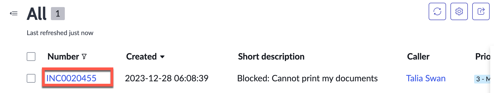
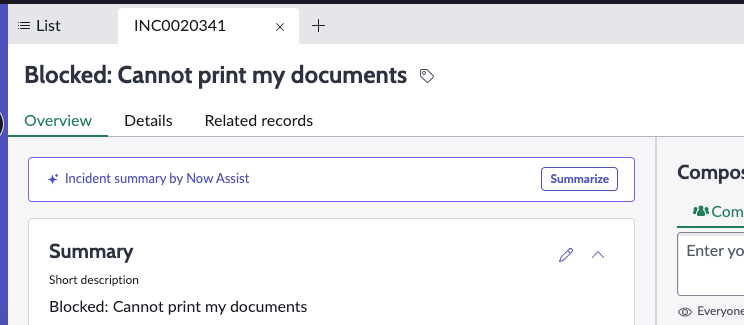

# Section 3. Now Assist for the Agent Persona

In Section 3, we will learn how Now Assist will help an agent close an issue faster by reducing the time needed to understand a case, propose a solution, and look through the work notes to generate a resolution.

## Section 3.1 Incident Summarization

**Estimated time: 10 minutes**

### Step 1: Access Service Operations Workspace

1. Please return to your lab instance by clicking on the **ServiceNow logo** in the upper-left corner. Alternatively, you can remove any portal suffix from your instance URL; for example, my URL looks like this.

2. Select the **Workspace** tab and select **Service Operations Workspace**

Service Operations Workspace provides a consolidated view to aid agents in managing the life cycle of task records, such as incidents, requests, and walk-ups.

### Step 2: Navigate to Incidents

3. Let's get to know Service Operations Workspace a little. We are going to search for a specific incident to work with. First, select **list view**, and then under **incidents**, select **All** to get a list of incidents.

### Step 3: Filter for Specific Incidents

4. In that list view, select the **filter funnel** on the upper right side.

5. Select the **advanced view** at the bottom and then fill out the conditional filter to find incidents with a short description starting with **"Blocked:"**

6. Select **update** to run the query.

### Step 4: Open Target Incident

6. Select the **incident link**. Your incident number may be different from the one shown.

### Step 5: Generate Incident Summary

7. Select the **Summarize** button to use Generative AI to summarize the incident.

The summarization skill analyzes the short description, description, work notes, and related records before generating the issue, SLAs, impacted services, and actions taken up to that point.

**Why This Matters:** As an agent, this is extremely helpful if there are multiple updates to the work notes and the text is dense; when a ticket is assigned to the agent, the Agent must spend 15 minutes reading all the work notes. Instead, they can read the Now Assist summarization in a minute.

### Step 6: Review Summary Features

8. Notice the different icons at the bottom. The thumbs up/down are used to send feedback during re-training of the Now LLM (if the customer has opted into data sharing). You can copy the text to a clipboard as well as regenerate the summary.

### Step 7: Add Summary to Work Notes

9. Let's add the generated summary to our work notes by selecting the **Share** button.

> **Note:** Your incident summarization may look slightly different from the screenshot shown below.

10. Edit the summary by adding a bulleted item like the one below and then select **Save to work notes**.

**Data Sharing Note:** If the customer has opted in for data sharing, then the edits to the generated response are also sent to the Now LLM for fine-tuning.

11. Expand the **work note activity stream** to see that your edits were copied.

## 🎉 Congratulations!

You have created an incident summary and posted it to the work notes! Please don't close the Service Operations workspace or the incident tab; we will use it in the next section.

> **Bonus:** Return to the Incident list and try the summarization skill with ANY in-progress incident. Try it a few times!

## Section 3.2 Resolution Note Generation

**Estimated time: 5 minutes**

### Step 1: Access Resolve Function

1. Within Service Operations Workspace, return to the incident from Section 2.1 with the short description, **"Blocked…"**

2. In the upper-right corner of the incident, locate the **Resolve** button. Click it to generate resolution notes.

### Step 2: Configure Resolution

3. Now Assist looks through the work notes of the current ticket and generates the potential resolution.

   a. In the **Resolve pop-up window**, select a resolution code from the drop-down: **Solution provided**.

   b. Edit the resolution note as needed.

   c. Click **"Resolve"** to save it to the ticket.

### Step 3: Verify Resolution

4. Select the **details** tab of the Incident. Notice that the resolution was copied to the **Resolution notes** field, and the state of the ticket went from **New** to **Resolved**.

## 🎉 Congratulations!

You have generated resolution notes and resolved an incident! Please don't close your browser or incident tab; we will use it in the next section.

> **Bonus:** Return to the Incident list and try resolving ANY in-progress incident. Can you find another way to generate resolution notes? (Hint: look for the sparkles.)

## Section 3.3 Knowledge Creation

**Estimated time: 5 minutes**

With the help of Now Assist, we reviewed and resolved an incident in record time. But what if this is a recurring issue? We can save time for the next agent by creating a draft of a knowledge article, informed by the information we provided in the incident.

### Step 1: Create Knowledge Article

1. On the same **"Blocked: Cannot print my documents"** Incident, let's create a Knowledge article. In the upper right-hand corner of the incident, locate the **drop-down menu** between "Create change request" and "Reopen". Click **"Create Knowledge"**.

### Step 2: Generate Article with AI

2. A related record will be created, and a pop-up will appear. Click **"Yes"** and allow Now Assist to draft the knowledge article for you.

### Step 3: Review Generated Content

3. Review the **article body**. How closely does it match the details in the Incident?

> **Tip:** In this lab, the Generate Knowledge skill is only available when the incident is in a "Resolved" or "Closed" state. Availability filters can be updated to fit your processes.

### Step 4: Save Knowledge Article

4. In the **"Knowledge base"** field, select **"IT"**. Then click **"Save"**. The article will be created in a draft state and follow the publishing flow set up by your organization.

## 🎉 Congratulations!

You have created a knowledge article! Please don't close your browser or the workspace, we'll continue exploring it in the next section.

## Section 3.4 Change Summarization

**Estimated time: 5 minutes**

It often turns out that the cause of an incident was an improper change. In this section, we will see how Change Summarization can capture the important details of a Change Request and present them to stakeholders.

### Step 1: Navigate to Changes

1. Select **list view**, then scroll down to **"Changes"**. Select **"Open"** to get a list of all open Change Records.

### Step 2: Open Target Change Record

2. From the list of open Changes locate and click on **"CHG0044021"**.

### Step 3: Generate Change Summary

3. Select the **"Summarize"** button on the Overview to see the Summary of the Change Request

## 🎉 Congratulations!

You have summarized a change request and completed Now Assist for the Agent persona.

---

**Next Step:** [Section 4 - Now Assist for the Employee Persona](section4-employee-persona.md)