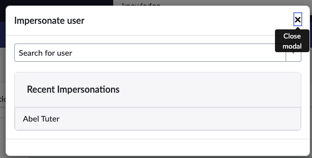
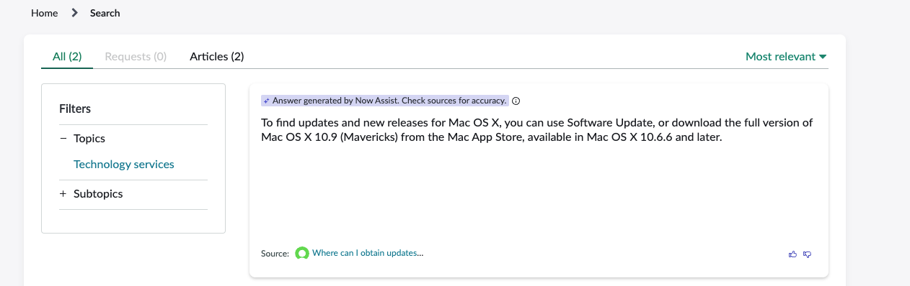
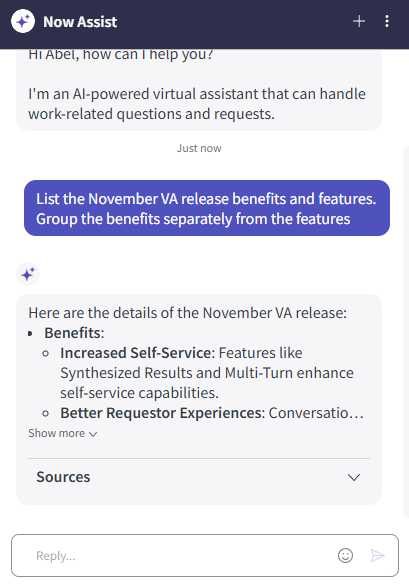
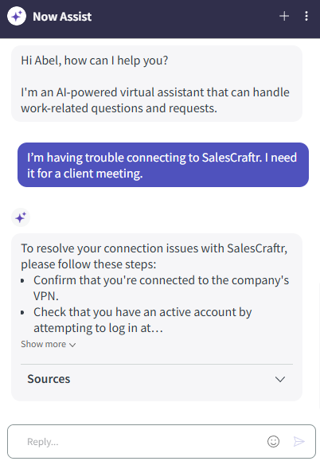
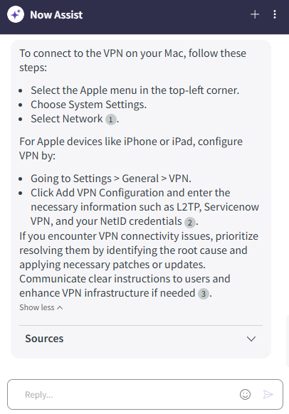
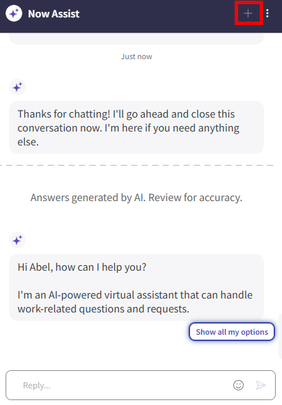
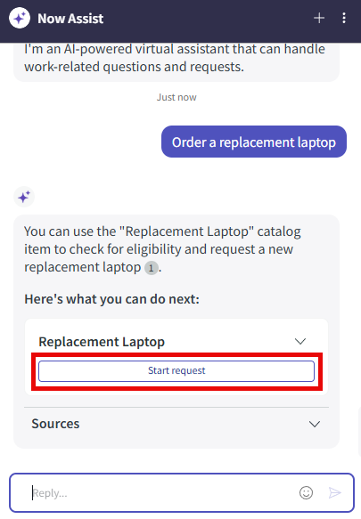
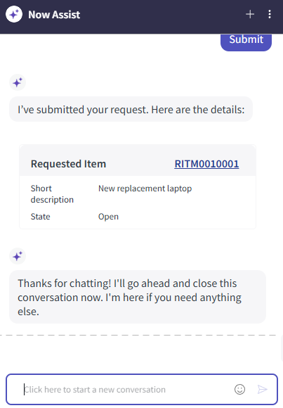

# Section 4. Now Assist for the Employee Persona

In Section 4, you will learn how Now Assist enhances AI Search and changes how companies use chatbots.

## Section 4.1 Superpowered Search

**Estimated time: 10 minutes**

### Step 1: Impersonate User

1. **IMPORTANT:** Select the **profile picture** in the upper right-hand corner and **impersonate a user: Abel Tuter**. The window will reload.

### Step 2: Access Employee Center

2. Next, open the **employee center** by navigating to **All > Self-Service > Employee Center**. Alternatively, in your browser's address bar, append **"/esc"** to the end of the instance URL. For example:

### Step 3: Test AI Search

3. In the **search box**, type **"Where can I obtain updates and new releases for Mac OS X"** and select **enter**.

**How AI Search Works:** Now Assist uses AI Search to pull the top-ranked knowledge article, then sends it to the Now LLM to generate an answer to the original question. This is a huge time-saver, as employees only need to read part of the knowledge article; we use Now LLM to provide a succinct answer.

### Step 4: Provide Feedback

Notice the **"Was this suggestion helpful"** option; when you click the thumbs up or thumbs down, feedback is sent to the Now LLM (if the customer has not opted out of participating in data sharing).

## 🎉 Congratulations!

You have finished reviewing Now Assist for Search. Let's move on to the next section.

> **Dive Deeper:** ServiceNow use a Retrieval Augmented Generated (RAG) architecture that puts a semantic search engine before an LLM. If you want to get into the details of the architecture, check out the excellent article by Sean Hughes, "Under the Hood: Now Assist in AI Search".

## Section 4.2 Now Assist for the Virtual Agent

**Estimated time: 15 minutes**

### Background: The Evolution of Chatbots

Before we test out Now Assist for Virtual Agent, let's pause for a quick history lesson:

All chatbots – including ServiceNow's Virtual Agent (VA) – require some development. VA provides out-of-the-box conversations to reduce that development, but customers must still use developers to modify those out-of-the-box conversations to suit their unique needs.

**Generative AI changed all that.** If a user's request could be answered by a knowledge article or a catalog item (in many cases, up to 70% of incidents/cases fall into this category), then Now Assist in VA would dynamically generate the conversation – **NO DEVELOPMENT needed**. This is huge, and you're about to see why.

### Step 1: Access Virtual Agent

1. Select the **Now Assist in VA icon** on the lower right.

> **Tip:** If you cannot see the VA icon, you probably aren't in the Employee Center. Make sure you go to the correct URL!

### Step 2: Test Multi-Topic Conversation

2. Copy and paste the following into the Now Assist window: **"List the November VA release benefits and features. Group the benefits separately from the features"** and hit **enter**.

3. Now, copy and paste the following: **"I'm having trouble connecting to SalesCraftr. I need it for a client meeting"** and hit **enter**.

**Note how Now Assist switches tracks and follows the change in conversation.**

### Step 3: Test Personalized Responses

4. Next, type **"How do I connect to VPN?"** and hit **enter**.

**Smart Context Awareness:** Because Abel's assets are recorded in ServiceNow, Now Assist knows that Abel has a Mac and provides the appropriate instructions.

### Step 4: Test Service Catalog Integration

Next, let's try ordering something from the service catalog.

1. In the upper-right corner of the VA window, click the **(plus icon)** to start a new conversation.

2. Now type **"Order a replacement laptop"** into the Now Assist window, and hit **enter**.

The **"Replacement Laptop"** item will be suggested.

3. Click **Start Request**.

**Dynamic Conversation Generation:** Now Assist in VA looks at the "Replacement Laptop" catalog item and dynamically generates a conversation from the mandatory inputs (variables) needed to request the item.

### Step 5: Test Dynamic Form Handling

4. If you are prompted for a region, select **"AMS"**, then click **Make Changes**

5. Now type **"Change my region to EMEA"**, then click **Submit**. Notice the change.

## 🎉 Congratulations!

You have tested search, engaged in a multi-turn conversation with Now Assist, and even ordered a replacement laptop. You have completed this section!

**Key Takeaways:**
- Now Assist for Virtual Agent eliminates the need for custom development in most common scenarios
- The system provides contextually aware responses based on user data
- Dynamic conversation generation works seamlessly with service catalog items
- Multi-turn conversations maintain context and can switch topics naturally

---

**Next Step:** [Section 5 - Now Assist for the IT Ops Agent](section5-itops-agent.md)