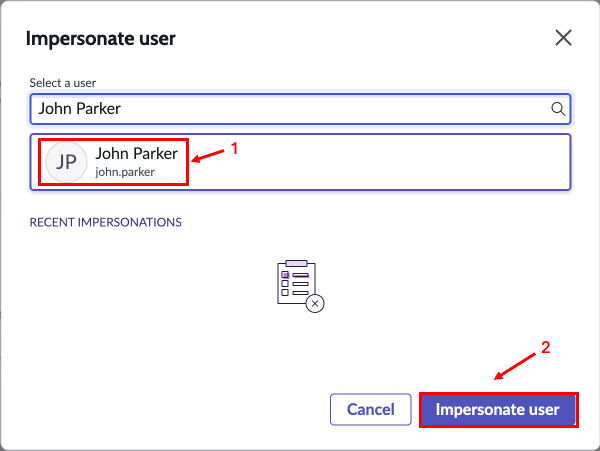

# Section 5. Now Assist for the IT Ops Agent

**Estimated time: 10 minutes**

This portion of the lab will highlight how Now Assist for ITOM can help an operations agent quickly analyze single and groups of alerts to gain context and understanding of issues, helping to reduce mean time to repair (MTTR).

You will impersonate a user who has the role of the event management operator and use Now Assist for ITOM to analyze alerts.

## Section 5.1 Lab Configuration

Log into your instance as the system administrator, using the "magic link".

Before starting the lab, we'll make sure the two skills for Now Assist for ITOM are enabled. These steps will be similar to the steps you followed in Section 1 when enabling Now Assist.

### Step 1: Enable ITOM Skills

1. Navigate to **All > Now Assist Admin > Features**.
2. Under **Technology**, select **ITOM**.
3. Click **View details**.

Both skills should be active:
- Alert Analysis
- Alert Group Analysis

### Step 2: Activate Skills (If Needed)

If either of the skills are inactive, click **Activate skill** as needed (in the following screens, make sure both Display options are toggled on, and then click **Save**, then **Done**).

## Section 5.2 Exploring the Express List

The operator is the person who views alerts and tries to determine what the issues are, what impact they are having, and how to resolve them. In this section, you will act as an operator. As this lab is focused on Now Assist, we will not explore in any detail the other actions an operator would take in the context of AIOps but just how Now Assist can help analyze alerts.

### Step 1: Impersonate Operator User

The operator user for this portion of the lab is **John Parker**.

1. You can impersonate **John Parker** by clicking on the **user icon** in the upper right and selecting **"Impersonate another user."**

2. Select **John Parker** and click **Impersonate user**.

### Step 2: Access Express List

As an operator, when John Parker logs in, he is directed to the Service Operations Workspace. The operator views and works on alerts in the Express List, a view within the Service Operations Workspace.

3. Close any popups that appear when you first login and then open the **Express List** on the left navigation bar (the second icon from the bottom).

4. Close the popup window that appears.

### Step 3: Adjust Time Window

Normally, an operator would see alerts that are being reported by monitoring tools in the Express List in near real time. For the purposes of this lab, alerts have been captured and pre-loaded onto your instance. Due to this, the times for when the alerts happened may not be recent enough to appear in the default window, so let's expand the window.

5. On the upper right on the Express List, click on the dropdown that says **Last 24 hours** and change it to say **All Time**. This will show alerts that came into the system.

The Express List should now show more alerts and some alert groups. You will see FEWER than this screen shot!

### Understanding Alerts and Events

**What are alerts?** In ServiceNow, the raw payloads that come from monitoring tools are called **events**. Many of these events are simply noise, meaning they contain information that an operator would not act upon. These could be events that are informational, haven't met a particular threshold, haven't happened enough times to be concerning, etc. These noisy events can be simply ignored, and ServiceNow can reduce the noise by never showing those events to an operator.

**Events that are important enough for an operator to investigate and act against are called alerts.** The Express List shows alerts to the operator.

**Alert Groups:** There are times when alerts are related to each other. For example, if there is a web server that is timing out on connections because the server it is hosted on is out of memory or compute resources, there may be alerts coming in against both the web server for those transaction failures and alerts for the server resource issues.

In the Express List, the groups of alerts are the ones that have the **circled number** on the right of the alert number. To see the other alerts in the group, click the **arrow** on the left side of the alert number for the primary alert of the group.

## Section 5.3 Alert Analysis

Now Assist for ITOM can analyze a group of alerts and consider many factors, resulting in an analysis that can significantly reduce the time an operator would need to spend going through each alert in the group and understanding what happened and how it is related to things reported in other alerts of the group.

In this part of the lab, you will leverage Now Assist for ITOM as an operator to experience hands on what an operator would see when analyzing some individual alerts and groups of alerts.

### Step 1: Select Alert for Analysis

1. Find the alert with number **Alert0010002**. Click somewhere on the **Description** of the alert. It opens the details panel.

### Step 2: Analyze Alert Group

2. Click on the **Analyze** button. It may take a few moments to return as information about the group of alerts is being analyzed by Now Assist for ITOM.

### Step 3: Review Analysis Results

3. Once the result returns, the analysis for the alert group is shown. Read through it for an example of the type of analysis Now Assist for ITOM will perform to help an operator quickly gain insight into what happened and what to look for to repair the issue.

**What the Analysis Provides:**
- Root cause identification
- Impact assessment
- Related alert correlation
- Recommended remediation steps
- Timeline of events

### Step 4: End Impersonation

4. When you are done reading the analysis, end the impersonation by clicking on the **user icon** in the upper right and clicking **End impersonation**.

## 🎉 Congratulations! 

You have completed the Now Assist for ITOM portion of the lab!

**Key Benefits Demonstrated:**
- **Faster MTTR:** Quick analysis of complex alert groups
- **Context Understanding:** AI correlates related alerts automatically  
- **Actionable Insights:** Clear recommendations for resolution
- **Operator Efficiency:** Reduces time spent manually analyzing alerts

---

**Next Step:** [Section 6 - Now Assist for the Developer Persona](section6-developer-persona.md)