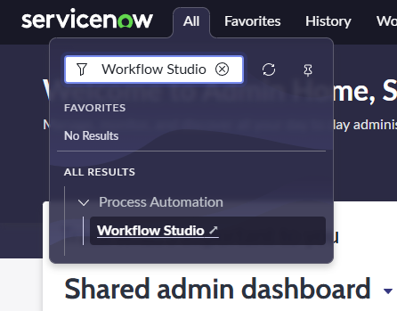
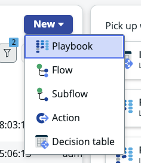

# Section 6. Now Assist for the Developer Persona

**Estimated time: 10 minutes**

This section will examine how Now Assist for Creator provides power tools for developers to support Service Operations.

## Section 6.1 Playbook Generation

### Step 1: Access Workflow Studio

1. Open **Workflow Studio** (All > Process Automation > Workflow Studio). The ServiceNow platform uses workflows to orchestrate process steps and integrate them into systems; Flow Designer is used to build out those workflows.



2. Flow Designer will open in a new tab. On the far right, click the **"New"** button. From the dropdown menu, select **"Playbook"**



### Step 2: Generate Playbook

3. Click **Try an example**. Review the directions that were generated.


4. Enter a **playbook name**, then click **"Generate playbook preview"**.


### Step 3: Review Generated Playbook

5. Take a closer look at the resultant flow! You have a huge jumpstart on the playbook development with help from Now Assist for Creator. When you are finished, click **Discard playbook**.


**What You've Accomplished:** Now Assist for Creator generated a complete workflow with multiple steps, decision points, and integrations based on natural language instructions. This dramatically reduces development time from hours to minutes.

## Section 6.2 Flow Generation

### Step 1: Create New Flow

1. You should be back in the Workflow Studio tab. This time, select **New > Flow**.


### Step 2: Generate Flow from Prompt

2. Click on **"Try an example"**, give the flow a name, and hit **Generate flow preview**.


### Step 3: Review Generated Flow

3. Review the proposed flow. Does it follow the directions laid out by the Now Assist prompt?


**Key Features of Generated Flows:**
- Proper trigger configuration
- Logical step sequencing  
- Appropriate conditions and branching
- Integration with ServiceNow tables and APIs
- Error handling considerations

### Step 4: Clean Up

4. When you are finished, click **Discard flow**.
5. Finally, close the **Workflow Studio** tab.

## Section 6.3 Code Generation

### Step 1: Access Script Includes

1. Go to **All > System Definition > Script Includes**. A script is a reusable server-side script that provides logic to define a function or class.


### Step 2: Create New Script Include

2. Select **New** in the upper right-hand corner.


3. Close any popups that appear, then give the Script Include a **Name** (e.g., `[Your initials] Test Script`) and a **Description** of `"My first test script"`.


### Step 3: Generate Code with AI

4. Replace the default code with following:

```javascript
//predict assignment group using predictive intelligence classification model
```


5. Now, hit **CMD + Return (Mac)** or **CTRL + ENTER (Windows)**

**AI Code Generation in Action:** This feature allows you to use Now Assist to write a custom script based on your instructions.


### Step 4: Save Your Work

6. When you are finished, click **Submit**


**What Now Assist Generated:**
- Complete function implementation
- Proper ServiceNow API usage
- Error handling logic
- Documentation comments
- Best practice patterns

## 🎉 Congratulations!

You have completed the Now Assist for the Developer persona portion of the lab!

**Key Developer Benefits Demonstrated:**
- **Rapid Prototyping:** Generate complex workflows in minutes
- **Code Acceleration:** AI-powered script generation from natural language
- **Best Practices:** Generated code follows ServiceNow standards
- **Learning Tool:** See proper implementation patterns
- **Productivity Boost:** Focus on business logic rather than boilerplate code

**Developer Productivity Impact:**
- **Playbooks:** Hours to minutes for complex workflow creation
- **Flows:** Instant generation of multi-step processes
- **Scripts:** Intelligent code completion and generation
- **Consistency:** Standardized patterns across development team

---

**Next Step:** [Section 7 - Now Assist Skill Kit](section7-skill-kit.md)