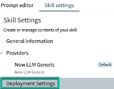
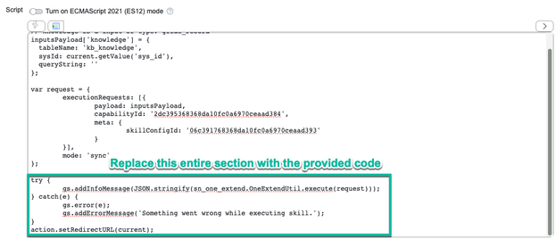
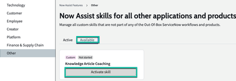

# Section 7. Now Assist Skill Kit

**Estimated time: 5 minutes**

The Now Assist Skill Kit (NASK) enables you to extend Now Assist with custom skills tailored to your organization's specific needs.

## Explore the NASK Community Resources

Go to the following community site and familiarize yourself with the NASK features:

**Visit:** [https://www.servicenow.com/community/now-assist-articles/now-assist-skill-kit-use-case-library/ta-p/3053580](https://www.servicenow.com/community/now-assist-articles/now-assist-skill-kit-use-case-library/ta-p/3053580)

## What You'll Find in the Community

The Now Assist Skill Kit Use Case Library provides:

### 📚 **Documentation and Guides**
- Comprehensive setup instructions
- Best practice implementation guides
- Troubleshooting resources
- API documentation

### 🛠️ **Ready-to-Use Skills**
- Pre-built skill templates
- Industry-specific use cases
- Integration examples
- Customization patterns

### 💡 **Use Case Examples**
- Customer service automation
- IT operations optimization
- HR process enhancement
- Field service improvements

### 🤝 **Community Support**
- User forums and discussions
- Expert advice and tips
- Shared experiences and solutions
- Feature requests and feedback

## Key NASK Capabilities

**Custom Skill Creation:**
- Build organization-specific AI capabilities
- Integrate with external systems and data sources
- Create domain-expert knowledge assistants
- Automate complex business processes

**Extensibility Framework:**
- Plugin architecture for easy skill deployment
- APIs for custom integrations
- Webhooks for real-time data processing
- Template system for rapid development

**Enterprise Integration:**
- Connect to legacy systems
- Utilize existing data repositories
- Maintain security and compliance standards
- Scale across multiple departments

## Access Skill Kit

Now Assist Skill Kit (NASK) allows you to create new generative AI skills using the generic Now LLM or your own LLM.  NASK has been designed to easily manage and integrate new skills into the ServiceNow platform via a UI Action and soon into the Now Assist Panel. With NASK you define the input data, leverage tools to process the data, activate the new skill, and deploy it to the platform.

For our use case we will use NASK to send a prompt to the LLM asking it to review the contents of our knowledge article, and to provide suggestions on how to improve it. This feedback will be stored in a Feedback Task attached to the knowledge article.

Prior to running this lab, please ensure that you create a knowledge article with the following content. This has some intentional grammaer, spelling and structural issues. 

```
R u having trouble with ur Outlook inbox? It can b a real pain in the butt when things aren't working rite, huh? Well, let me break it down 4 u and give u sum tips on how to fix those pesky issues.

First of all, one common problem peepl have with their Outlook inbox is that emails are not showing up or they r disappearing randomly. This can b super frustrating, especially if you're waiting for an important email. One possible reason for this is that ur inbox is getting too full and causing Outlook to glitch out. So, what u can do is try clearing out sum old emails or moving them to a different folder to free up sum space.

Another issue u might encounter is that ur inbox is running super slow or freezing up. This could be due to a bunch of different factors, like a slow internet connection, a bug in the Outlook program, or a problem with ur computer's hardware. To help speed things up, try closing out of any unnecessary programs or tabs, restarting ur computer, and checking for any updates to the Outlook program.

Sumtimes, u might find that emails r not sending or receiving properly in ur inbox. This could b because of incorrect email settings, a problem with ur internet connection, or issues with the recipient's email server. To troubleshoot this problem, double-check ur email settings to make sure everything is set up correctly, restart ur internet connection, and reach out to ur email provider if necessary.

Overall, dealing with issues in ur Outlook inbox can b a real headache. But by following these tips and staying patient, u should b able to troubleshoot and fix those problems like a pro. Good luck!

```

Ensure that you save the number of the knowledge article that you just created. We will be using it later. 

Now let's build the custom skill. 

Type ```Now Assist Skill Kit``` in the function list. 


Click create new skill. 

Name the skill Knowledge Article Coach. In this lab, we will be using the Now LLM service to complete our task, so ensure the Default provider and Provider API values are both set to Now LLM Generic.


Add a new skill input by clicking the plus icon next to it. This is where we add the reference to a knowledge article to use within the prompt.


Populate the skill input form as seen below, replacing the test record with the number of your knowledge article from phase 1. Once complete, click Add skill input.


[Optional] Click the Pencil Icon next to the prompt name to rename the prompt. We are renaming it to Knowledge Coach here. Click Save changes.


In the prompt field, remove the template text and replace it with the following:

```
You are an AI model specialized in evaluating the quality of knowledge base articles on IT issues. A knowledge base article that covers a specific IT topic will be presented. Your task is to perform a quality check on the article by evaluating it against the following criteria:


Rubric for quality check:
1. Clarity and Conciseness: The article should be easy to understand, with clear, concise language that avoids unnecessary jargon.
2. Comprehensiveness: The article should cover all necessary aspects of the issue, including steps for resolution, potential pitfalls, and any additional resources.
3. Grammar and Language Use: The article should be free from spelling, grammar, and punctuation errors, and the language should be professional and appropriate for the audience.
4. Usability: The article should be organized in a user-friendly manner, with clear headings and step-by-step instructions that help the user navigate the content.


Evaluation Instructions:
- Each criterion should be evaluated as either "Satisfactory" or "Unsatisfactory."
- If a criterion is evaluated as "Satisfactory," provide no additional explanation.
- If a criterion is evaluated as "Unsatisfactory," provide a brief explanation of why the article does not meet the criteria.
- By the end of the evaluation, if one or more criteria were deemed "Unsatisfactory," provide overall improvement suggestions.


Article to be assessed:
```

Click in the text box to add your cursor focus to the end of the prompt. (i.e. have the flashing line appear after the text “Article to be assessed”). Click Insert inputs.


Click on the arrow icon next to the Knowledge skill input we added in step 5.


Select Article body.


Your prompt field should now contain a reference to the skill input:


Click Save.


**Test the custom skill**

Scroll down to the Test prompt section. Click Run tests.


From the dialog box that appears, verify which knowledge article you wish to test your skill against, then click Run Tests.


Verify the output from the LLM is to your liking. You can iterate upon the provided prompt if you desire.


To verify if information from your skill inputs is being brought in correctly, click on the tab named Grounded prompt. You will see the input that was delivered to the LLM, including your knowledge article text.


Once content with the output of your skill, click Finalize prompt.


**Deploy the custom skill**

Click on Skill settings at the top of the page.


Click on the option named Deployment Settings.



Underneath the workflow header, set the value to be Other.
Tick the option marked UI Action, and set the table to Knowledge (to do so, type in kb_knowledge and scroll down until you find it)


Click Create UI Action, then Link to UI Action once it appears.


A new window containing your UI Action will appear. Change the value in the Name field to Review my article.


In the script field, replace everything from the try statement and below with the code provided below. Ensure you replace the instance URL with your instance’s URL.



```
try {

    var output = sn_one_extend.OneExtendUtil.execute(request)['capabilities'][request.executionRequests[0].capabilityId]['response'];

   

      var newFeedback = new GlideRecord("kb_feedback");

newFeedback.initialize();

newFeedback.article = current.sys_id;

var feedbackSysId= newFeedback.insert();


      var newTask = new GlideRecord("kb_feedback_task");

        newTask.initialize();

        newTask.assigned_to = gs.getUserID();

         newTask.feedback = feedbackSysId;

        newTask.short_description = "Knowledge Article Feedback generated by NowLLM";

        newTask.description = JSON.parse(output).model_output;

        var newTaskSysid = newTask.insert();


        //get the link to the new case/incident

        var mylink = '<a href="https://INSTANCE URL.service-now.com/kb_feedback_task.do?sys_id='+newTaskSysid.toString()+'">here</a>';


        //publish an info message

        gs.addInfoMessage("We have finished reviewing your Knowledge article and have created a feedback task for you to review. Click " +  mylink +  " to open.");


} catch(e) {

    gs.error(e);

    gs.addErrorMessage('Something went wrong while executing skill.');

}

action.setRedirectURL(current);
```

Click Update to save the record.
Return to your skill within Now Assist Skill Kit.
In the top right corner, click Publish.


In the module that opens, tick the box containing your finalized prompt, then click Publish.


**Activate the custom skill**

Navigate to Now Assist Admin from within the filter navigator.


Click on Now Assist Features, then Other to find your published skill.


Click on the tab named Available to find your published skill. Click Activate skill.



Set the Display trigger to true, then click Save and continue.


Review the next page, then click Activate.


Dismiss the message stating confirmation of activation.

**See the custom skill in action**

Type kb_knowledge.list into the filter navigator. Find the knowledge article you wish to run your custom skill on and open the record.


Click the UI Action you created – you may have named it something else.


Review the information message that appears. Click the link in the message to open the feedback task.
Review the output from your custom skill in the description field of the feedback task.


Congratulations! You have now created and deployed a custom skill.

## Next Steps After the Lab

1. **Explore the Community:** Browse available skills and use cases
2. **Plan Your Implementation:** Identify specific organizational needs
3. **Start Small:** Begin with simple, high-impact use cases
4. **Collaborate:** Engage with the community for support and ideas
5. **Scale Gradually:** Expand successful implementations across teams

## 🎉 Congratulations!

You have completed the entire ServiceNow AI Agents for Service Operations workshop lab!

**What You've Accomplished:**
- ✅ Enabled Now Assist and explored the Admin Console
- ✅ Built custom AI agents and use cases
- ✅ Implemented agent workflows for incident management
- ✅ Tested Now Assist across multiple personas (Agent, Employee, IT Ops, Developer)
- ✅ Generated content with AI assistance (summaries, resolutions, knowledge articles)
- ✅ Experienced AI-powered search and virtual agent capabilities
- ✅ Created workflows and code using Now Assist for Creator
- ✅ Learned about extending capabilities with the Skill Kit

**Ready for Production:**
You now have the foundational knowledge to implement ServiceNow AI Agents and Now Assist in your organization. Consider starting with the highest-impact use cases that align with your business objectives.

---

**Additional Resources:**
- [Appendix A1: Now Creator Sample Prompts](appendix-a1-sample-prompts.md)
- [Appendix A2: Agent Ideas](appendix-a2-agent-ideas.md)
- [Appendix A3: AI Search Set-Up](appendix-a3-ai-search-setup.md)
- [Appendix A4: Application Scope](appendix-a4-application-scope.md)